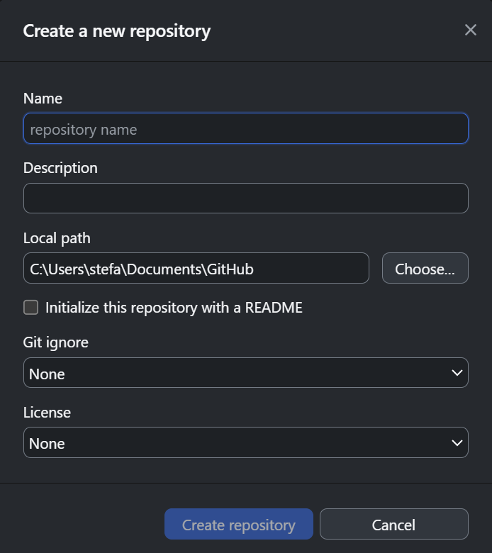
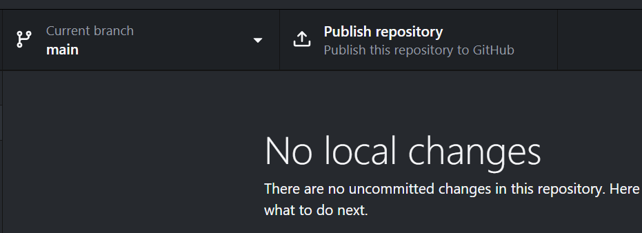

[GitHub](https://github.com/) is a platform that allows you to store, share, and archive files. It is commonly used for in research to make files accessible, including code, data, models, and figures. Sharing code and data through platforms like GitHub helps make research more transparent, reproducible, and credible [Braga et al. 2023](https://doi.org/10.1111/2041-210X.14108). In this blog post, I will show you how to create your first GitHub repository ("repo" for short), how to set up a convenient folder structure, and how to push (i.e., upload) and pull (i.e., download) content to and from the repo. The [Center for Scholarly Communication](https://csc-ubc-okanagan.github.io/) (CSC) also runs a two-part workshop on how to use GitHub. The material is available on the CSC website: [Part 1](https://csc-ubc-okanagan.github.io/workshops/Intro-GitHub-Part-1.html) and [Part 2](https://csc-ubc-okanagan.github.io/workshops/Intro-GitHub-Part-2.html).

Before we start, you will need to download and install [GitHub Desktop](https://github.com/apps/desktop) from [https://desktop.github.com/download/](https://desktop.github.com/download/). While it installs, make an account on [github.com](github.com) if you don't have one already.

To make your first repo, go to `File/New repository` or press `Ctrl + N`.

Now choose your repo's name. Something short and simple, like `my-first-repo` works for now. If you want, you can also add a description of the repo's contents and change the location of the local copy that GitHub Desktop will make. On my personal machine, I tend to save repos in `Documents/GitHub`, but on my lab machine I save them in my UBC home drive: `H:/GitHub`. If you are planning on working primarily with only one language (e.g., `R` or `Python`), I would suggest choosing the appropriate Git ignore. This will hide files that you generally don't want to push to GitHub (e.g., `.Rhistory` and `.RData` files). You can change the `.gitignore` files later with any text editor. The last step here is to choose a license. If you want a simple open-access licence for code, the MIT one is a good option.

You've now created your first GitHub repo, but it is currently only on your local machine. To push it to GitHub, you'll need to publish the repo (top ribbon, to the right). Before confirming, you can:

1) update the name (this won't change the name of the folder on your machine),
2) edit the description,
3) decide whether you want the repo to be public or not (it's private by default), and
4) choose if you want to add it into an existing organization (e.g., your lab's organization). Be careful though -- it can be hard to edit the repo after you've added it to an organization.

Now that the repo is on GitHub, you can start pushing and pulling content to and from it. As a general rule, you should always check for any updates by pulling (click `Fetch-origin` followed by `Pull origin`) before trying to push anything, otherwise GitHub will have to manage the pull/push conflict by merging the old files (to be pulled) with the new ones (to be pushed). This can be quite confusing, so it's always good to make to pull first (even if you're the only one working on the repo on two machines). Once you have some files you want to push to the repo, select the ones you want to push by clicking on the boxes in the upper left, add a summary for the commit (i.e., the series of changes to push) at the bottom of the column. Commit summaries should be brief and simple but clear, like "cleaned data and started model fitting". You can use markdown in both the summary and the description (see the field below the summary field) for messages like "removed unnecessary `library()` calls" using `\(\text{`text`}\)`. In the changes column, green "+" symbols indicate new files, yellow dots indicate changed files, and red "-" symbols indicate file deletions. The panel on the right will show you exactly what portions of a file you changed, if the file is a simple text file (e.g., `.csv.`, `.R`, `.Rmd`, `.md`, and `.txt`, but not `.pdf`, `.doc`, `.ppt`, or `.rds`). Consequently, GitHub's version control and edit history work best if you use simple text files as much as possible. Once you've committed all your changes, don't forget to push the changes to GitHub using the "Push origin" button! You can check the status of your changes by going to [GitHub](https://github.com/) and navigating to your repo.

# References

Braga P.H.P., Hébert K., Hudgins E.J., Scott E.R., Edwards B.P.M., Sánchez Reyes L.L., et al. (2023). Not just for programmers: How GitHub can accelerate collaborative and reproducible research in ecology and evolution. Methods in Ecology and Evolution 14, 1364–1380. https://doi.org/10.1111/2041-210X.14108
